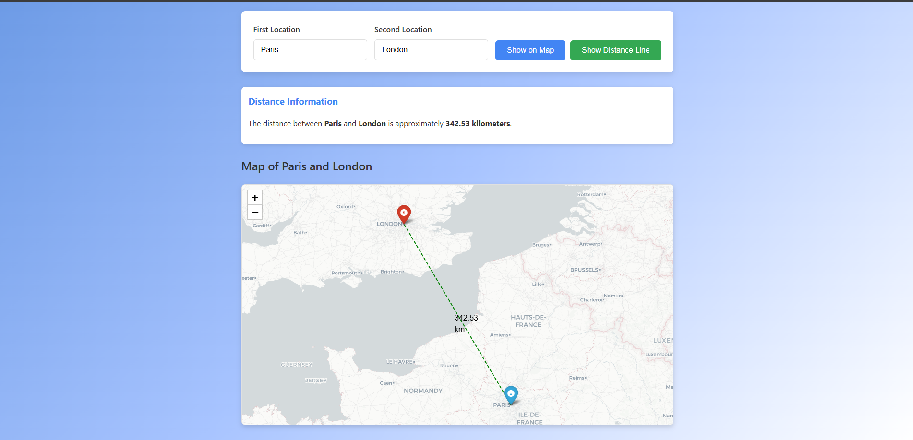

        

# Web-Map-App

This dynamic map allows users to input two custom locations of their choice. Once selected, the map displays pins at each location, with a connecting line that calculates and shows the distance in kilometers between them.

## Features

- Allows users to input custom locations.
- Displays pins on a map at those locations.
- Shows the distance in kilometers between the selected locations.

## Technologies Used

- Python
- HTML
- CSS
- JavaScript

## Usage

1. Input two locations on the map.
2. A line is drawn connecting the two pins.
3. The distance in kilometers is displayed between the locations.

## License

This project is licensed under the MIT License - see the [LICENSE](LICENSE) file for details.

## Screenshots

